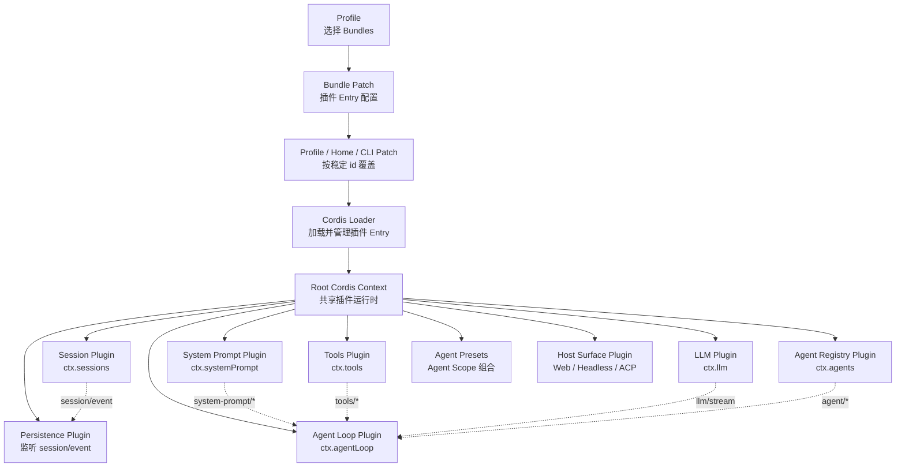
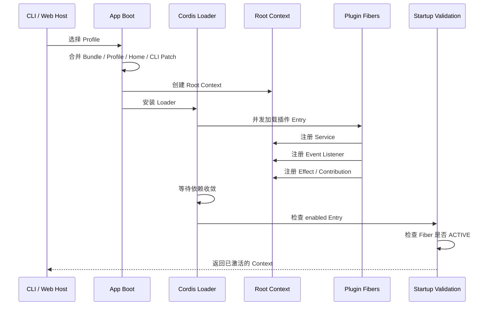
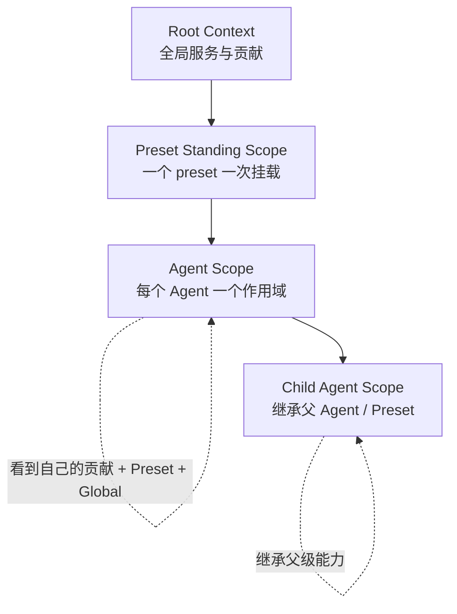
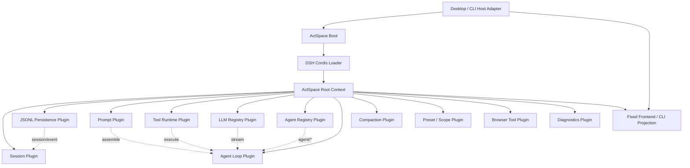

你说得对。现在 ActSpace 的后端确实已经偏离了 DSH 的核心思路：

> 当前更像是“一个集中式 `bootRuntime()` 创建所有对象，再用 `RuntimeHandle` 暴露所有能力”；  
> DSH 则是“先建立 Cordis 插件树，每个插件自己注册服务、事件和可撤销副作用，Host 只消费这棵树”。

所以问题不只是 `RuntimeHandle` 太大，而是整个后端的“组合中心”放错了。

## 一、DSH 的真正架构

DSH 的核心链路是：



DSH 官方架构文档直接说明：

- 产品的每个部分都是 Cordis 插件，包括模型适配器、工具注册表、Session、Agent Loop。
- 插件通过 Context 注册服务、事件和可撤销 effect。
- 不存在一个必须被修改的“特权核心”。
- Profile 和 Bundle 只是决定哪些插件被挂载、使用什么配置。

具体见 [DSH architecture.md](/Users/wakeup-jin/Desktop/code-project/side-project/actspace-agent/tmp/deepseek-harness/docs/architecture.md:9)。

## 二、DSH 的插件不是“配置行”，而是真正拥有行为

DSH 的每个核心插件都有自己的服务对象和生命周期。

| 插件 | 自己拥有的东西 | 暴露的服务 |
|---|---|---|
| Session | Session 日志、Surface、事件提交 | `ctx.sessions` |
| Persistence | JSONL 写入、恢复、flush | 监听 `session/event` |
| System Prompt | Prompt section、context、tool schema | `ctx.systemPrompt` |
| Tools | 工具注册、审批、执行流水线 | `ctx.tools` |
| LLM | Provider adapter registry、stream API | `ctx.llm` |
| Agent | Agent registry、Agent 生命周期 | `ctx.agents` |
| Agent Loop | 默认 Agent 创建和 Turn 驱动 | `ctx.agentLoop` |
| Agent Preset | Agent Scope 下的插件组合 | `ctx.agentPresets` |

例如 Session 插件自己明确说明：Persistence 不属于 Session 内部，而是另外的插件，通过监听事件完成持久化：

[SessionStore](/Users/wakeup-jin/Desktop/code-project/side-project/actspace-agent/tmp/deepseek-harness/packages/core/session/src/index.ts:792)

System Prompt 自己维护贡献层：

[SystemPrompt](/Users/wakeup-jin/Desktop/code-project/side-project/actspace-agent/tmp/deepseek-harness/packages/core/system-prompt/src/index.ts:338)

Tools 自己维护工具注册和执行流水线：

[ToolRuntime](/Users/wakeup-jin/Desktop/code-project/side-project/actspace-agent/tmp/deepseek-harness/packages/core/tools/src/index.ts:787)

LLM 自己维护 Adapter 注册表：

[LlmRuntime](/Users/wakeup-jin/Desktop/code-project/side-project/actspace-agent/tmp/deepseek-harness/packages/llm/llm/src/index.ts:284)

Agent Loop 只是一个插件，它通过依赖声明消费其他服务：

[AgentLoop](/Users/wakeup-jin/Desktop/code-project/side-project/actspace-agent/tmp/deepseek-harness/packages/core/agent-loop/src/index.ts:296)

这里非常关键：

```ts
static inject = [
  'agents',
  'sessions',
  'llm',
  'tools',
  'systemPrompt',
]
```

它不是被某个中央 `RuntimeManager` 手动塞入依赖，而是由 Cordis 根据服务可用性决定是否能够激活。

## 三、DSH 的启动流程

DSH 的启动并不是：

```text
创建 RuntimeHandle
  -> 创建 Session
  -> 创建 Tools
  -> 创建 AgentLoop
  -> 塞入 serviceValues
```

而是：



DSH 的 Boot 只负责：

1. 创建根 Context；
2. 安装 Loader；
3. 挂载配置树；
4. 等待 Loader settlement；
5. 检查插件是否 ACTIVE；
6. 失败时销毁整个 Context。

详细实现见 [app-boot/src/index.ts](/Users/wakeup-jin/Desktop/code-project/side-project/actspace-agent/tmp/deepseek-harness/packages/boot/app-boot/src/index.ts:764)。

Boot 最终返回的是：

```ts
Context
```

不是一个包含几十个业务方法的 `RuntimeHandle`。

这就是当前 ActSpace 和 DSH 最大的结构差异。

## 四、Agent 的一次 Turn 是怎样流动的

DSH 的 Agent Loop 也不是一个“黑盒服务调用”，而是由 Session、Prompt、LLM、Tools、Agent Events 一起协作。

```mermaid
sequenceDiagram
  participant User
  participant Agent
  participant Loop as Agent Loop
  participant Prompt as ctx.systemPrompt
  participant LLM as ctx.llm
  participant Tools as ctx.tools
  participant Session as ctx.sessions
  participant Hooks as Plugin Hooks

  User->>Agent: followup(message)
  Agent->>Loop: 唤醒 Driver

  Loop->>Session: turn/start
  Loop->>Hooks: agent/pre-step
  Hooks-->>Loop: reject 或 enter(messages)

  Loop->>Session: step/start
  Loop->>Session: user/message
  Loop->>Prompt: system-prompt/assemble
  Prompt-->>Loop: 完整 Prompt + Tool Schemas

  Loop->>LLM: agent/request
  LLM->>LLM: llm/stream
  LLM-->>Loop: StreamChunk
  Loop->>Session: assistant/chunk
  Loop->>Session: assistant/message

  opt 模型产生 Tool Call
    Loop->>Session: tool/call
    Loop->>Tools: tools/pre-execute
    Loop->>Tools: tools/execute
    Loop->>Tools: tools/post-execute
    Tools-->>Loop: Tool Result
    Loop->>Session: tool/result
  end

  Loop->>Session: step/end
  Loop->>Hooks: agent/turn-stopping
  Loop->>Session: turn/end
```

DSH 对这部分有一个非常重要的划分：

- `turn/*`、`step/*`、`user/message`、`assistant/*`、`tool/*` 是持久化事实。
- `agent/*`、`llm/stream`、`tools/*` 是实时扩展点。
- 任何模型可见内容都必须能够从 Session 日志重建。

见 [Turn Flow](/Users/wakeup-jin/Desktop/code-project/side-project/actspace-agent/tmp/deepseek-harness/docs/architecture.md:63)。

这意味着插件可以独立介入：

- 一个插件可以修改 `agent/pre-step`；
- 一个插件可以增加 Prompt section；
- 一个插件可以注册工具；
- 一个插件可以监听 LLM 流；
- 一个插件可以实现 Persistence；
- 一个插件可以拦截工具执行；
- 一个插件可以提供新的 LLM Adapter。

而这些都不需要修改 Agent Loop 的源码。

## 五、DSH 的 Scope 设计

DSH 还有一层非常重要的 Agent Scope。



一个 Agent 使用的工具、Prompt、事件监听器，不一定是全局的。

它可以挂在：

```ts
agent.ctx
```

上面。

这样：

- 全局工具对所有 Agent 可见；
- Preset 工具只对加入该 Preset 的 Agent 可见；
- Agent 自己的工具只对该 Agent 可见；
- 子 Agent 可以继承父 Agent 的能力；
- 卸载 Agent Scope 时，所有注册自动撤销。

DSH 的 Scope 文档明确说明：

> Scope 负责同进程内插件的可见性与生命周期，不是安全沙箱。

见 [dsh-scope README](/Users/wakeup-jin/Desktop/code-project/side-project/actspace-agent/tmp/deepseek-harness/packages/core/scope/README.md:5) 和 [Agent Presets README](/Users/wakeup-jin/Desktop/code-project/side-project/actspace-agent/tmp/deepseek-harness/packages/preset/agent-presets/README.md:5)。

## 六、DSH 的 Host 并不依赖一个万能 RuntimeHandle

DSH 的 Web 和 Headless 不是两个后端内核，而是两个不同的 Host Surface Bundle。

### Headless

Headless 插件直接通过 Context 获取服务：

```ts
const agents = ctx.get('agents')
const sessions = ctx.get('sessions')

const { agent } = await agents.create(...)
agent.followup(...)
await agent.whenIdle()
await sessions.flush(agent.session)
```

见 [headless runner](/Users/wakeup-jin/Desktop/code-project/side-project/actspace-agent/tmp/deepseek-harness/packages/bundle/headless/src/index.ts:111)。

### Web

Web 插件则消费 WebServer、SystemPrompt、ShellEnv 等服务，并自己注册静态文件服务和界面相关能力：

[web-app plugin](/Users/wakeup-jin/Desktop/code-project/side-project/actspace-agent/tmp/deepseek-harness/packages/bundle/web-app/src/index.ts:139)。

也就是说：

```text
Web Host
  -> Context
  -> ctx.agents / ctx.sessions / ctx.systemPrompt / ctx.loader

Headless Host
  -> Context
  -> ctx.agents / ctx.sessions / ctx.llm

ACP Host
  -> Context
  -> ctx.agents / ctx.sessions / ctx.tools
```

所有 Host 使用同一个插件运行时，但每个 Host 自己决定如何把 Context 能力映射成：

- HTTP API；
- CLI 输出；
- ACP；
- WebSocket；
- UI projection。

DSH 并没有把所有这些操作压进一个几十个方法的 RuntimeHandle。

## 七、当前 ActSpace 为什么看不出插件化

### 1. `runtime/boot.ts` 是真正的中央内核

当前 ActSpace 的 [bootRuntime](/Users/wakeup-jin/Desktop/code-project/side-project/actspace-agent/packages/agent-runtime/src/runtime/boot.ts:66) 做了太多事情：

- 创建 Session Controller；
- 创建 Diagnostics；
- 创建 Prompt；
- 创建 Agent Registry；
- 创建 RunController；
- 创建 Compaction；
- 创建主 Agent；
- 创建 Subagent；
- 注册 Todo Tools；
- 注册 Subagent Tools；
- 创建 Tool Environment；
- 创建 LLM 运行时；
- 组织所有插件；
- 最后创建 `RuntimeHandle`。

尤其是这一段：

[serviceValues](/Users/wakeup-jin/Desktop/code-project/side-project/actspace-agent/packages/agent-runtime/src/runtime/boot.ts:165)

它本质上是一个中央服务总表：

```ts
const serviceValues = new Map([
  ["session.codec", codec],
  ["session.persistence", sessions],
  ["prompt", ...],
  ["tools", options.tools],
  ["llm", options.llm],
  ["agent.registry", agentRegistry],
  ["agent.loop", runs],
  ["compaction", compaction],
  ...
])
```

然后 builtin plugin 只是根据 manifest 查这个表：

```text
manifest entry
  -> service id
  -> serviceValues.get(service id)
  -> root.mount(...)
```

因此现在的“插件”更像：

```text
插件配置行 = 选择中央已经创建好的对象
```

而不是：

```text
插件自身 = 创建服务 + 注册贡献 + 注册事件 + 拥有销毁责任
```

这正是你感觉“插件化思路消失了”的原因。

### 2. 当前 Builtin Manifest 只是行为目录

[createDefaultComposition](/Users/wakeup-jin/Desktop/code-project/side-project/actspace-agent/packages/agent-runtime/src/profiles/composition.ts:21) 里面的 builtin manifest 主要描述：

- pluginId；
- entryId；
- provides；
- injects；
- config；
- required。

但是实际行为依然由 `runtime/boot.ts` 中的工厂代码提供。

所以这些 Manifest 不是 DSH 那种真正的插件入口，而是“中央内核的能力清单”。

### 3. `RuntimeHandle` 变成了 God Object

当前 [RuntimeHandle](/Users/wakeup-jin/Desktop/code-project/side-project/actspace-agent/packages/agent-runtime/src/runtime/runtime-handle.ts:30) 同时负责：

- Boot manifest；
- Diagnostics；
- Session 查询；
- Session 创建；
- Session 恢复；
- Session Fork；
- Turn 执行；
- Message 入队；
- Message 取消；
- Session Metadata；
- Workspace；
- Abort；
- Compaction；
- 直接 LLM 调用；
- Flush；
- Restart；
- Quiesce；
- Dispose。

这已经不是“生命周期句柄”，而是整个后端的业务总入口。

结果是：

- 新插件要增加能力，必须修改 RuntimeHandle；
- Host 和 Agent Core 被绑在一起；
- CLI、Desktop、插件都依赖同一个巨大接口；
- 任何服务替换都会波及 RuntimeHandle；
- 不能自然体现 Cordis 的服务依赖和插件卸载。

## 八、ActSpace 应该重新采用的核心模型

建议把 ActSpace v2 后端重新画成下面这样：



关键原则是：

### `RuntimeHandle` 降级为生命周期对象

它最多只负责：

```ts
type RuntimeHandle = {
  readonly context: Context
  readonly bootReport: StartupReport
  dispose(): Promise<void>
}
```

甚至 `context` 也可以由 Host Adapter 私有持有，不直接暴露给 React 前端。

它不应该继续拥有：

```text
createSession()
runTurn()
compactSession()
completeText()
enqueueMessage()
updateWorkspace()
```

这些应该属于不同的领域服务：

```text
ctx.sessions
ctx.agents
ctx.agentLoop
ctx.tools
ctx.llm
ctx.compaction
ctx.diagnostics
```

Host Adapter 再把这些服务映射为 Desktop IPC、CLI 命令或固定前端 DTO。

### 插件自己拥有构造和销毁

例如工具插件应该自己完成：

```ts
export default function ToolPlugin(ctx: Context, config: Config) {
  ctx.tools.register(...)
  ctx.on('tools/pre-execute', ...)
  ctx.effect(() => {
    // 注册资源
    return () => {
      // 自动撤销
    }
  })
}
```

LLM Adapter 插件应该自己完成：

```ts
ctx.llm.registerAdapter(...)
ctx.effect(...)
```

Prompt 插件应该自己完成：

```ts
ctx.systemPrompt.section(...)
ctx.systemPrompt.context(...)
```

Persistence 插件应该自己监听：

```ts
ctx.on('session/event', ...)
ctx.on('session/flush', ...)
```

而不是由 `runtime/boot.ts` 预先创建所有实例，再把实例放进 `serviceValues`。

## 九、重新理解“核心插件”

这不意味着所有东西都可以随意缺失。

DSH 的默认 Profile 仍然会要求：

```text
Session
Prompt
Tools
LLM
Agent Registry
Agent Loop
```

这些是默认产品需要的能力。

但它们仍然是插件：

```text
默认 Profile 必须挂载
缺少依赖则 PENDING
启动校验失败
可以由另一个实现替换
```

“必须存在”是 Profile 和启动策略的约束，不代表它们应该变成中央特权代码。

## 十、最终判断

当前 ActSpace 的问题可以概括为：

```text
Profile / Manifest
  -> 中央 bootRuntime 工厂
  -> serviceValues
  -> RuntimeHandle God Object
```

而 DSH 的模式是：

```text
Profile / Bundle / Patch
  -> Loader
  -> Cordis Root Context
  -> 每个插件拥有自己的 Service / Event / Effect
  -> Host Adapter 消费 Context
```

因此下一步不应该继续扩展现在的 `RuntimeHandle`，而应该先重新确定：

1. `RuntimeHandle` 只保留生命周期和启动报告；
2. `runtime/boot.ts` 不再创建所有 Agent Core 对象；
3. 每个 Agent Core 模块变成真正的 Cordis Plugin；
4. Manifest 直接指向插件行为，不再通过 `serviceValues` 查找；
5. Session、Prompt、Tools、LLM、Agent、AgentLoop 通过 Context Service/Event 连接；
6. Desktop、CLI 只作为 Host Adapter；
7. 固定前端继续保留原样，只消费 Projection DTO；
8. 现有具体工具实现迁移为真正的 Tool Plugin；
9. JSONL Persistence 作为独立插件；
10. Browser Bridge 作为 Host Capability + Browser Tool Plugin，而不是塞入 RuntimeHandle。

这才是 DSH 的插件化思路在 ActSpace 中真正落地后的形态。